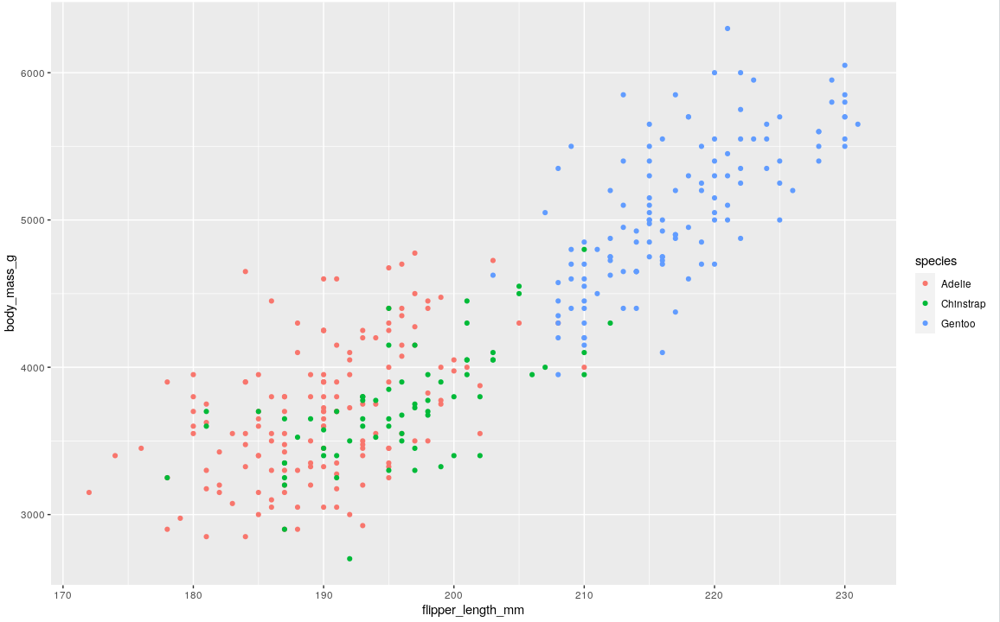

- always comes after mapping = in the [[ggplot()]] function
- arguments
	- x=
	- y=
	- color=
		- add a unique color to each level of the aesthetic
			- this process is called [[scaling]]
		- ex color= species in the #palmerpenguins
			- ggplot(data = penguins,
			              mapping = aes(x = flipper_length_mm, y = body_mass_g, color = species)) +
			              geom_point()
			- 
			-