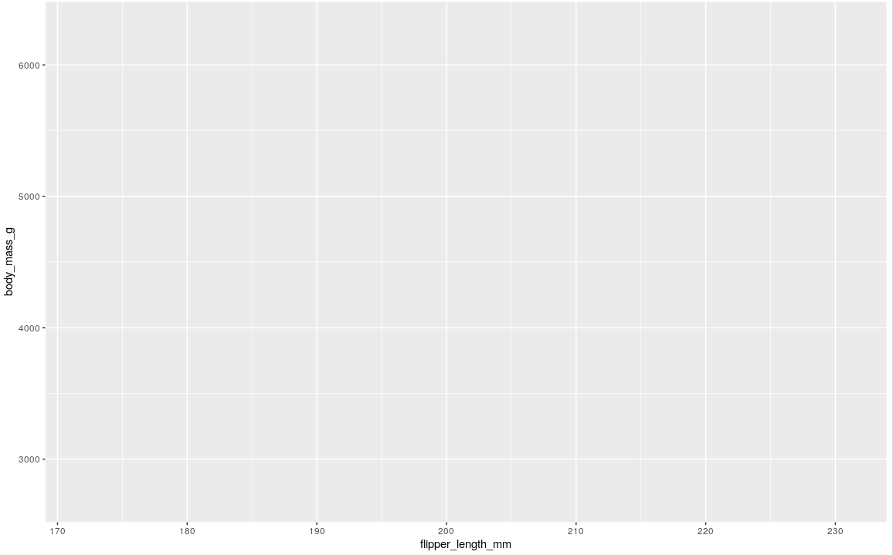
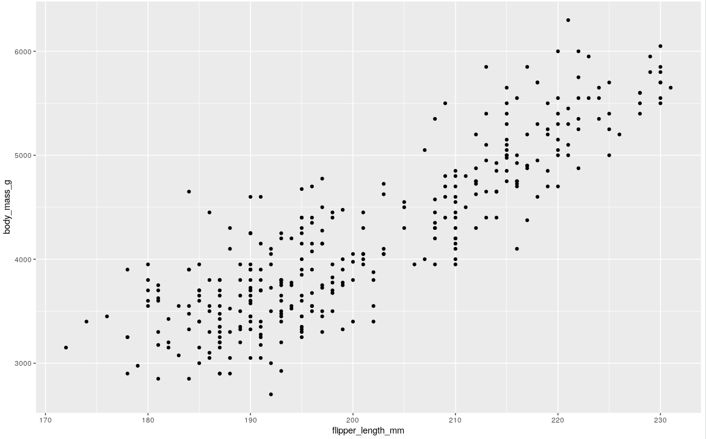
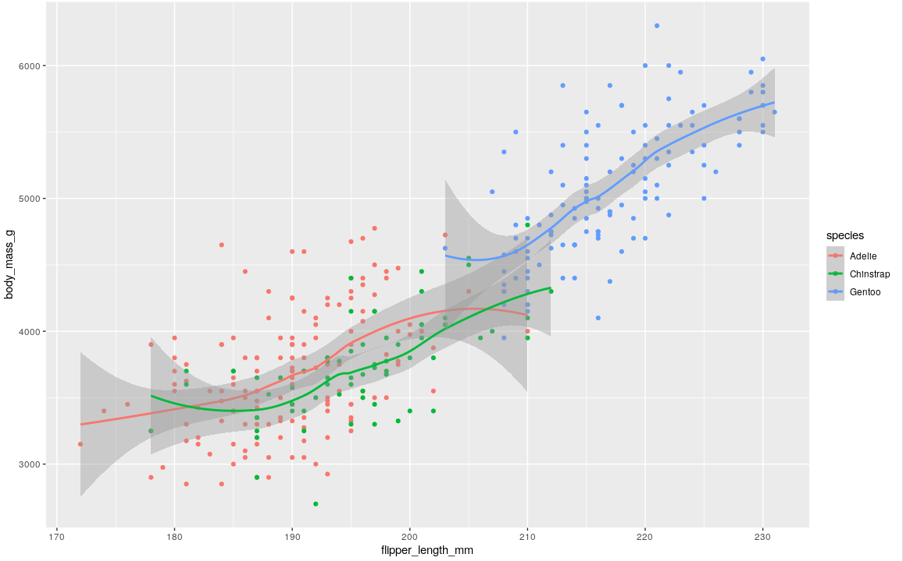
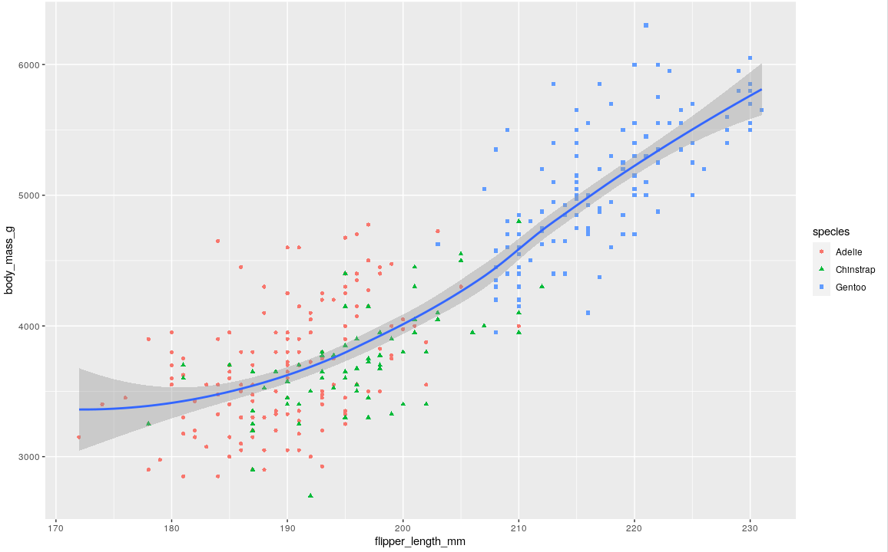
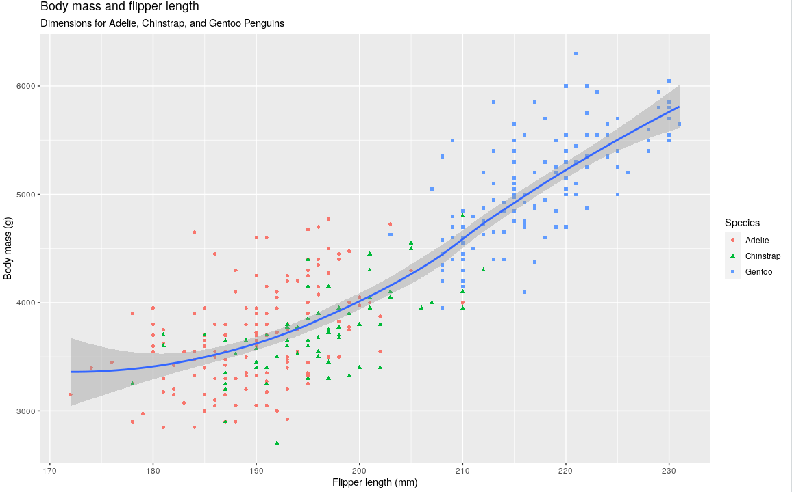

- layer by layer
- function ggplot()
- data inside function
	- ggplot(data=penguins)
- mapping argument
	- defines how variables in your dataset are mapped to visual properties of your plot
	- [[aesthetics]]
		- mapping is always paired with [[aes()]] function
			- the x and y arguments specify the variables for each axis
		- ggplot(data = penguins,
		              mapping = aes(x = flipper_length_mm, y = body_mass_g))
		- 
	- geom
		- the geometrical object used to represent the data
		- these geometric objects are made available in ggplot2 with functions that start with geom_
		- #bar_chart  use bar geoms geom_bar()
		- #line_chart use line geoms geom_line()
		- #boxplot use boxplot geoms geom_boxplot()
		- #scatterplot break the trend; they use the point geom [[geom_point()]]
		- add the geom argument with a + after aes()
		- ggplot(data = penguins,
		              mapping = aes(x = flipper_length_mm, y = body_mass_g)) +
		              geom_point()
			- 
		- add a smooth curve displaying the relationship between the variables with [[geom_smooth()]]
			- ggplot(data = penguins,
			              mapping = aes(x = flipper_length_mm, y = body_mass_g, color = species)) +
			              geom_point() +
			              geom_smooth()
			- 
			- a line for each specie in the data set
		- add color and shape to the points
			- ggplot(data = penguins,
			              mapping = aes(x = flipper_length_mm, y = body_mass_g)) +
			              geom_point(mapping = aes(color = species, shape = species)) +
			              geom_smooth()
			- 
			- a single line for the whole data set
		- improve the #label of the plot with [[labs()]]
			- ggplot(penguins, 
			         aes(x = flipper_length_mm, y = body_mass_g)) +
			         geom_point(aes(color = species, shape = species)) +
			         geom_smooth() +
			         labs(
			                 title = "Body mass and flipper length",
			                 subtitle = "Dimensions for Adelie, Chinstrap, and Gentoo Penguins",
			                 x = "Flipper length (mm)", 
			                 y = "Body mass (g)",
			                color = "Species", 
			                shape = "Species"
			    )
			- 
-